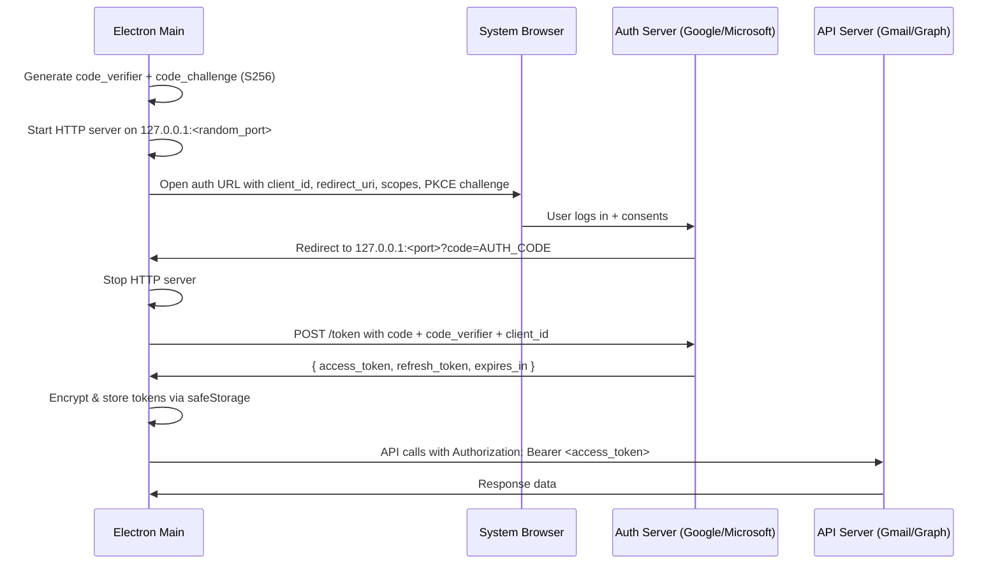

## §1 — Problem statement

Every day you log in to services that send OTP/verification codes to your email. You have to switch to your browser, find the email, copy the code, and switch back. With multiple email accounts across Gmail and Outlook, this friction multiplies.

**2Fast** is a lightweight desktop OTP retrieval utility built with Electron + TypeScript. It lets you trigger OTP checks on demand per connected Gmail or Outlook account, detects incoming OTP/verification codes, auto-copies them to your clipboard, and notifies you — all from a minimal desktop utility UI.

## §2 — Target users

- Developers and power users who receive frequent OTPs across multiple email accounts
- Anyone managing 2+ email accounts (Gmail / Outlook) who wants instant OTP access
- Security-conscious users who prefer a local desktop tool over browser extensions

## §3 — Core functionality (v0.1)

| Feature | Gmail | Outlook | Notes |
| --- | --- | --- | --- |
| **OAuth login** | ✅ | ✅ | PKCE + loopback redirect for both |
| **Multi-account** | ✅ N accounts | ✅ N accounts | Isolated token storage per account |
| **On-demand OTP query** | ✅ | ✅ | User clicks "Check OTP" per account; scans recent unread emails |
| **OTP extraction** | ✅ | ✅ | Regex engine with confidence scoring, trigger word detection |
| **Auto-copy to clipboard** | ✅ | ✅ | Instant clipboard write on OTP detection |
| **System notifications** | ✅ | ✅ | Native OS notification with OTP code + sender |
| **System tray** | ✅ | ✅ | Optional quick access, recent OTPs in context menu |
| **Compact OTP feed** | ✅ | ✅ | Small popover window with OTP cards + history |
| **OTP expiry** | ✅ | ✅ | Auto-expire after configurable TTL (default 10min) |
| **Launch on startup** | ✅ | ✅ | Optional; starts lightweight with no background polling loop |

## §4 — Feasibility verdict

<aside>
✅

**Fully feasible.** All three target configurations are explicitly supported by official APIs and OAuth flows.

</aside>

### Multi-Gmail (N accounts) — ✅ Feasible

- Google's OAuth 2.0 for **"installed applications"** (desktop) is a first-class flow
- Each Gmail account authorises independently → separate refresh/access token pair
- The `client_secret` for installed apps is **not truly secret** (Google documents this)
- **PKCE** (S256) is supported and recommended
- **Redirect method**: loopback IP `http://127.0.0.1:<port>` — Google explicitly supports this for desktop apps
- **Verification gate**: apps with <100 users can use "testing" mode. For broader distribution, use **BYOC** (Bring Your Own Credentials) where each user creates their own GCP OAuth client — **completely bypasses Google's app verification**
- Docs: [OAuth 2.0 for Desktop Apps](https://developers.google.com/identity/protocols/oauth2/native-app) · [Gmail API overview](https://developers.google.com/workspace/gmail/api/guides)

### Gmail + Outlook simultaneously — ✅ Feasible

- Microsoft Graph API supports **delegated permissions** for public client (desktop) apps
- MSAL Node (`@azure/msal-node`) handles auth code flow with PKCE out of the box
- Register app in **Azure / Microsoft Entra** as a public client → supports personal Microsoft accounts + work/school accounts
- No admin consent required for personal-account mail permissions
- Both providers use standard OAuth 2.0 auth code + PKCE → identical architectural pattern
- Docs: [Microsoft Graph Mail overview](https://learn.microsoft.com/en-us/graph/outlook-mail-concept-overview) · [Auth code flow](https://learn.microsoft.com/en-us/entra/identity-platform/v2-oauth2-auth-code-flow)

### N Gmail + N Outlook in one app — ✅ Feasible

- Each account (regardless of provider) gets its own token set stored via Electron `safeStorage`
- An `AccountManager` class maps `accountId → { provider, tokens, profile }`
- The `MailProvider` interface abstracts provider-specific API calls behind a unified contract
- No API-level limitation on concurrent accounts — the limit is UX, not technical

## §5 — API scopes

### Gmail API scopes

| Scope URI | Access level | Used for |
| --- | --- | --- |
| `https://www.googleapis.com/auth/gmail.modify` | Read, send, delete, manage labels | Core mail operations (covers read + send + labels) |
| `https://www.googleapis.com/auth/gmail.compose` | Create, send, and manage drafts | Compose + drafts (subset of modify — use if narrower scope desired) |
| `https://www.googleapis.com/auth/gmail.readonly` | Read-only | Fallback if user denies modify |
| `https://www.googleapis.com/auth/userinfo.email` | User email + profile | Display account name / avatar |

**Recommended v0.1 scope**: `gmail.modify` + `userinfo.email` — covers all read/send/label/draft operations with one consent screen.

Docs: [Gmail API scopes](https://developers.google.com/workspace/gmail/api/auth/scopes)

### Microsoft Graph scopes (delegated)

| Scope | Access level | Used for |
| --- | --- | --- |
| `Mail.ReadWrite` | Read, create, update, delete mail | Core mail operations |
| `Mail.Send` | Send mail as user | Sending / replying |
| `User.Read` | Read user profile | Display name / avatar |
| `offline_access` | Refresh tokens | Persistent sessions without re-login |

**Recommended v0.1 scope**: `Mail.ReadWrite Mail.Send User.Read offline_access`

Docs: [Graph permissions reference](https://learn.microsoft.com/en-us/graph/permissions-reference)

## §6 — OAuth flow (both providers)



**Key differences between providers:**

| Aspect | Google | Microsoft |
| --- | --- | --- |
| Auth endpoint | `accounts.google.com/o/oauth2/v2/auth` | `login.microsoftonline.com/{tenant}/oauth2/v2.0/authorize` |
| Token endpoint | `oauth2.googleapis.com/token` | `login.microsoftonline.com/{tenant}/oauth2/v2.0/token` |
| Client type | "Desktop" (installed app) | "Public client" (mobile & desktop) |
| `client_secret` | Required (but not truly secret for installed apps) | Not required for public clients |
| PKCE | Supported (recommended) | Required for public clients |
| Tenant | N/A | `common` (personal + org) or `consumers` (personal only) |
| SDK | `googleapis` npm | `@azure/msal-node` |

## §7 — Verification & distribution strategy

### Google — BYOC (Bring Your Own Credentials)

Google requires **app verification** for apps accessing restricted Gmail scopes with >100 users. This involves a security assessment costing **$15k–$75k**.

**Workaround for v0.1**: Ship with a **BYOC flow** — each user creates their own GCP project + OAuth Desktop client in <5 minutes. The app reads the user's `client_id` and `client_secret` from a config file or first-run setup wizard. This means:

- Zero verification cost
- Each user consents to their own OAuth client → no 100-user cap
- Full Gmail API access with no restrictions

### Microsoft — Shared public client

Microsoft's app registration for public clients:

- **No verification cost** for delegated permissions
- Personal Microsoft accounts: no admin consent needed for `Mail.ReadWrite`, `Mail.Send`, `User.Read`
- Work/school accounts: admin may need to pre-approve, but this is the org's responsibility
- Ship with a single shared `client_id` registered in Azure

## §8 — Locked stack

| Layer | Choice | Rationale |
| --- | --- | --- |
| Runtime | Electron 35+ (Chromium + Node 22) | Mature, cross-platform, full Node access |
| Language | TypeScript 5.x (strict mode) | Type safety, DX, ecosystem |
| Build | Vite 6+ (renderer) + tsc (main/preload) | Fast HMR, native ESM |
| Scaffold | `electron-vite` or manual Vite config | Recommended by Electron docs |
| Package manager | **pnpm** (only — no npm/yarn) | Fast, strict, workspace-ready |
| UI framework | React 19+ | Ecosystem, component model |
| Styling | Tailwind CSS 4+ + shadcn/ui | Utility-first, Notion-like components |
| Gmail SDK | `googleapis` (official Google npm) | Full Gmail REST coverage, typed |
| Microsoft auth | `@azure/msal-node` | Official MSAL for Node.js, PKCE support |
| Microsoft Graph client | `@microsoft/microsoft-graph-client` | Official Graph SDK, typed |
| Token storage | `safeStorage` (Electron built-in) | OS keychain integration (Keychain/libsecret/DPAPI) |
| Metadata store | `electron-store` | Simple JSON config persistence |
| Local DB | `better-sqlite3` | Synchronous, fast, no native build issues on Electron |
| IPC | `ipcMain.handle` / `ipcRenderer.invoke` | Typed, promise-based, sandboxed |
| Testing | Vitest (unit) + Playwright (e2e, later) | Vite-native, fast |
| Linting | ESLint 9+ (flat config) + Prettier | Consistency |
| Packaging | `electron-builder` | Cross-platform builds |

### Hard constraints

- [ ]  **No native modules** requiring `node-gyp` / Windows Build Tools. `better-sqlite3` is the sole exception (prebuilt binaries via `prebuild-install`).
- [ ]  **pnpm only**. Never `npm install` or `yarn add`.
- [ ]  **Strict TypeScript**. `"strict": true` in every `tsconfig.json`.
- [ ]  **Context isolation ON**, `nodeIntegration OFF**. All main↔renderer comms via` contextBridge`.

## §9 — Repo layout

```
2fast/
├── package.json          # root workspace
├── pnpm-workspace.yaml
├── tsconfig.base.json    # shared TS config
├── .eslintrc.cjs
├── .prettierrc
│
├── src/
│   ├── main/             # Electron main process
│   │   ├── index.ts      # app entry
│   │   ├── ipc/          # ipcMain handlers
│   │   ├── accounts/     # AccountManager, token store
│   │   ├── oauth/        # OAuthHandler (loopback server + PKCE)
│   │   ├── providers/    # MailProvider interface + impls
│   │   │   ├── types.ts  # MailProvider interface
│   │   │   ├── gmail.ts  # GmailProvider
│   │   │   └── outlook.ts # OutlookProvider
│   │   └── db/           # SQLite cache (Phase 7)
│   │
│   ├── preload/          # preload scripts
│   │   └── index.ts      # contextBridge.exposeInMainWorld
│   │
│   ├── renderer/         # React app (Vite)
│   │   ├── index.html
│   │   ├── main.tsx
│   │   ├── App.tsx
│   │   ├── components/
│   │   ├── hooks/
│   │   ├── pages/
│   │   └── styles/
│   │
│   └── shared/           # types shared across all processes
│       ├── ipc-api.ts    # IPC channel names + payload types
│       ├── models.ts     # Account, Message, Thread, Label, etc.
│       └── constants.ts
│
├── resources/            # app icons, static assets
├── scripts/              # build / dev scripts
└── tests/
    ├── unit/
    └── e2e/
```

## §10 — Gmail API endpoints (v0.1)

Base URL: `https://gmail.googleapis.com/gmail/v1`

| Operation | Method | Endpoint | Docs |
| --- | --- | --- | --- |
| List messages | GET | `/users/me/messages` | [messages.list](https://developers.google.com/workspace/gmail/api/reference/rest/v1/users.messages/list) |
| Get message | GET | `/users/me/messages/{id}` | [messages.get](https://developers.google.com/workspace/gmail/api/reference/rest/v1/users.messages/get) |
| Send message | POST | `/users/me/messages/send` | [messages.send](https://developers.google.com/workspace/gmail/api/reference/rest/v1/users.messages/send) |
| Modify labels | POST | `/users/me/messages/{id}/modify` | [messages.modify](https://developers.google.com/workspace/gmail/api/reference/rest/v1/users.messages/modify) |
| Trash message | POST | `/users/me/messages/{id}/trash` | [messages.trash](https://developers.google.com/workspace/gmail/api/reference/rest/v1/users.messages/trash) |
| List labels | GET | `/users/me/labels` | [labels.list](https://developers.google.com/workspace/gmail/api/reference/rest/v1/users.labels/list) |
| List threads | GET | `/users/me/threads` | [threads.list](https://developers.google.com/workspace/gmail/api/reference/rest/v1/users.threads/list) |
| Get thread | GET | `/users/me/threads/{id}` | [threads.get](https://developers.google.com/workspace/gmail/api/reference/rest/v1/users.threads/get) |
| Create draft | POST | `/users/me/drafts` | [drafts.create](https://developers.google.com/workspace/gmail/api/reference/rest/v1/users.drafts/create) |
| Send draft | POST | `/users/me/drafts/send` | [drafts.send](https://developers.google.com/workspace/gmail/api/reference/rest/v1/users.drafts/send) |
| Get attachment | GET | `/users/me/messages/{id}/attachments/{attachId}` | [attachments.get](https://developers.google.com/workspace/gmail/api/reference/rest/v1/users.messages.attachments/get) |
| User profile | GET | `/users/me/profile` | [users.getProfile](https://developers.google.com/workspace/gmail/api/reference/rest/v1/users/getProfile) |

## §11 — Microsoft Graph endpoints (v0.1)

Base URL: `https://graph.microsoft.com/v1.0`

| Operation | Method | Endpoint | Docs |
| --- | --- | --- | --- |
| List messages | GET | `/me/messages` or `/me/mailFolders/{id}/messages` | [List messages](https://learn.microsoft.com/en-us/graph/api/user-list-messages) |
| Get message | GET | `/me/messages/{id}` | [Get message](https://learn.microsoft.com/en-us/graph/api/message-get) |
| Send mail | POST | `/me/sendMail` | [Send mail](https://learn.microsoft.com/en-us/graph/api/user-sendmail) |
| Reply | POST | `/me/messages/{id}/reply` | [Reply](https://learn.microsoft.com/en-us/graph/api/message-reply) |
| Forward | POST | `/me/messages/{id}/forward` | [Forward](https://learn.microsoft.com/en-us/graph/api/message-forward) |
| Delete message | DELETE | `/me/messages/{id}` | [Delete message](https://learn.microsoft.com/en-us/graph/api/message-delete) |
| List folders | GET | `/me/mailFolders` | [List mailFolders](https://learn.microsoft.com/en-us/graph/api/user-list-mailfolders) |
| Create draft | POST | `/me/messages` | [Create draft](https://learn.microsoft.com/en-us/graph/api/user-post-messages) |
| Send draft | POST | `/me/messages/{id}/send` | [Send draft](https://learn.microsoft.com/en-us/graph/api/message-send) |
| List attachments | GET | `/me/messages/{id}/attachments` | [List attachments](https://learn.microsoft.com/en-us/graph/api/message-list-attachments) |
| Get attachment | GET | `/me/messages/{id}/attachments/{attachId}` | [Get attachment](https://learn.microsoft.com/en-us/graph/api/attachment-get) |
| Search messages | GET | `/me/messages?$search="query"` | [Search messages](https://learn.microsoft.com/en-us/graph/search-query-parameter) |
| User profile | GET | `/me` | [Get user](https://learn.microsoft.com/en-us/graph/api/user-get) |

## §12 — Phase overview

| # | Phase | Delivers | Status |
| --- | --- | --- | --- |
| 1 | Scaffold | Repo, build pipeline, dev server, `pnpm verify` passes | ✅ Done |
| 2 | IPC & shared types | Typed IPC bridge, shared models, preload sandbox | ✅ Done |
| 3 | Google OAuth (single account) | BYOC setup, loopback OAuth, token encryption, account stored | ✅ Done |
| 4 | Gmail message list | GmailProvider, message list UI, read message, labels sidebar | ✅ Done |
| 5 | Microsoft OAuth + Outlook list | MSAL auth, OutlookProvider, unified message list, folders | ✅ Done |
| 6 | Multi-account UX | AccountManager, account switcher sidebar, add/remove accounts | ✅ Done |
| 7 | OTP Query & Extraction Engine | Manual per-account OTP query, regex OTP extraction, clipboard + notifications, OTP feed UI | 🔴 Next |
| 8 | Tray UI, Polish & Packaging | System tray, compact popover, settings, electron-builder, CI, README | 🔴 Pending |
| 9 | Protocol-based providers | Provider registry, encrypted read-only IMAP, presets, custom IMAP | ✅ Done |

## §13 — Risk register

| Risk | Impact | Likelihood | Mitigation |
| --- | --- | --- | --- |
| Google app verification cost ($15k–$75k) | High | Certain (if distributing) | **BYOC** — each user brings their own OAuth client |
| Gmail API rate limits (250 quota units/user/sec) | Medium | Low | User-triggered queries, short lookback window (last 5min), max 20 emails/query, exponential backoff |
| Microsoft Graph throttling (10,000 req/10min/app) | Medium | Low | Filtered queries (unread + recent only), retry-after headers |
| OTP false positives (order numbers, promo codes) | Low | Medium | Confidence scoring, trigger word proximity, body length filter, sender allowlist |
| OTP format diversity (new patterns) | Low | Medium | Pluggable pattern engine, configurable regex list |
