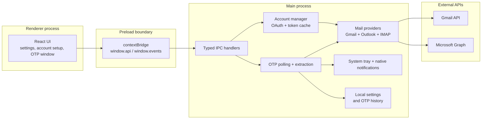

# 2Fast

[](https://github.com/SomneelSaha2042/2FAst/actions/workflows/ci.yml)


2Fast is a tray-first desktop utility for finding one-time passwords in Gmail, Outlook, and secure IMAP accounts without opening a full mail client. Connect your accounts, pick the mailbox you are waiting on, and 2Fast scans the latest messages for OTP-style codes so you can copy them quickly.

The current beta is focused on a small, practical workflow: link accounts, reconnect them when tokens expire, scan recent messages on demand, and keep a short-lived OTP history in the tray.

## Features

- Multi-account Gmail, Outlook, Yahoo, iCloud, Fastmail, Zoho, Proton Bridge, and custom IMAP linking
- Bring-your-own Google OAuth client setup for Gmail
- Microsoft public-client OAuth with PKCE for Outlook
- On-demand OTP scans from the tray account menu
- OTP extraction with confidence scoring
- One-click copy from the compact OTP window
- Optional auto-copy and native notifications
- Recent OTP history with expiry
- Settings for polling interval, notifications, startup, and sender allowlist
- Debug poll logs are off by default and redacted when enabled

## How To Use

1. Install and launch 2Fast.
2. Open the tray menu and choose settings.
3. For Gmail, follow the in-app BYOC setup guide and save your Google OAuth client credentials.
4. Add a Gmail or Outlook account.
5. When you are waiting for a code, open the tray menu and select the account to scan.
6. Copy the detected code from the compact OTP window.
7. Use reconnect from settings if an account token expires or access is revoked.

2Fast scans only the latest configured message window for the account you choose. It is designed for quick OTP lookup, not as a full email client.

## Tech Stack

| Area | Technology |
| --- | --- |
| Desktop runtime | Electron 42 |
| Main process | Node.js 22 + TypeScript |
| Renderer | React 19 + Vite 8 |
| Styling | Tailwind CSS 4 via Vite |
| IPC | Electron `ipcMain.handle` / `ipcRenderer.invoke` with preload `contextBridge` |
| Local settings | `electron-store` |
| Gmail integration | `googleapis` |
| Microsoft auth | `@azure/msal-node` |
| Outlook integration | Microsoft Graph SDK |
| Testing | Vitest |
| Packaging | electron-builder |
| Package manager | pnpm |

## Architecture



The renderer is intentionally sandboxed. All privileged operations run in the main process and are reached through the typed preload bridge.

## Integrated APIs

### Gmail

- Google OAuth 2.0 desktop app flow
- Gmail API readonly message access
- `googleapis` SDK
- BYOC setup so each user supplies their own Google OAuth client

Required Gmail scope:

```text
https://www.googleapis.com/auth/gmail.readonly
```

### Outlook

- Microsoft Entra public client OAuth with PKCE
- MSAL Node token cache
- Microsoft Graph Mail APIs
- Delegated mail permissions for reading recent messages

Core Microsoft scopes are configured in `src/main/oauth/microsoft-config.ts`.

See [docs/API_SCOPE_INDEX.md](docs/API_SCOPE_INDEX.md) for endpoint and documentation references.

## Privacy And Security

- Renderer windows run with `contextIsolation: true`, `nodeIntegration: false`, and sandboxing enabled.
- The renderer talks to the main process only through the typed preload bridge.
- Tokens are managed in the main process and are not exposed to React.
- OTP poll logs are disabled by default.
- When debug logging is enabled with `TWOFAST_DEBUG_POLL=1`, OTP codes are redacted before writing logs.
- Email bodies are used only for local OTP extraction during a scan.

## Prerequisites

- Node.js 22+
- pnpm 10+

## Development

```bash
pnpm install
pnpm dev
```

Run the full validation gate:

```bash
pnpm verify
```

`pnpm verify` runs TypeScript, ESLint, and Vitest. The current suite has 56 passing tests across 17 test files.

## Build And Release

Build app assets:

```bash
pnpm build
```

Create an unsigned local installer:

```bash
pnpm dist
```

The distributable Windows installer is written to `release/2Fast Setup <version>.exe`. The expanded `release/win-unpacked/` directory is for local inspection and testing, not distribution.

## Beta Release Notes

- Current beta target: `v0.9.0-beta.1`
- Windows NSIS installer size: about 99.63 MB
- Release artifacts are currently unsigned.
- Updates are manual for this beta.
- Windows and macOS may show security prompts because artifacts are unsigned.
- Release checklist: [docs/RELEASE_CHECKLIST.md](docs/RELEASE_CHECKLIST.md)

## Roadmap

Planned improvements include:

- OAuth authentication for third-party protocol providers
- SMTP sending and JMAP support
- Smaller packaged builds through deeper dependency trimming
- Signed Windows and macOS releases
- Automatic update support after signing and release infrastructure are ready
- More configurable OTP extraction rules and sender trust settings
- A planned v2 Tauri runtime migration track to reduce desktop footprint while preserving the same tray-first workflow

## License

MIT
